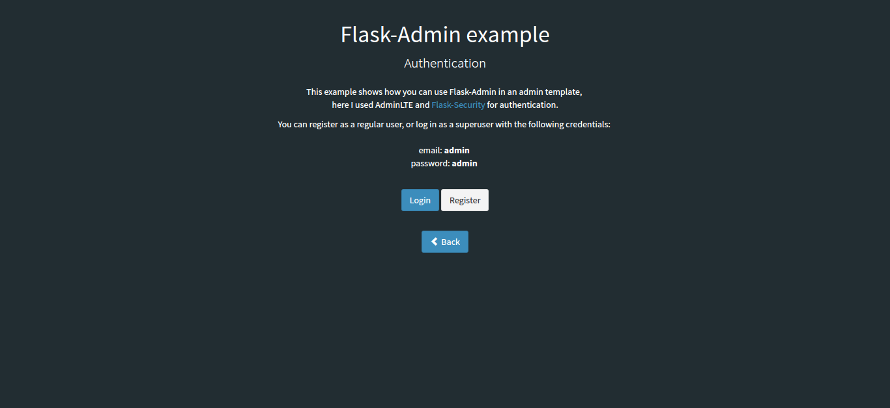

# Flask-Admin Dashboard Example


Basic dashboard app with [AdminLTE](https://adminlte.io/) template and
[Flask-Admin](https://pypi.org/project/Flask-Admin/), it has:

- User Registration.
- Login as general or admin user.
- Roles management.
- Create form in modal window by default.
- Inline editing enabled by default.
- Skins and  layout customization.
- Dashboard, charts, chat and calendar examples.
 
## Utilities

There are using many utilities, as the following:

  - [AdminLTE Bootstrap template](https://adminlte.io/).
  - [Flask-Security](https://pypi.org/project/Flask-Security/).
  - [Flask-Admin](https://pypi.org/project/Flask-Admin/).
  - A lot of Charts libraries.
  - [SQLite](https://www.sqlite.org/).


----


## Requirements

Please execute the following commands:

```sh
$ sudo apt update && sudo apt upgrade -y
$ sudo apt install -y python3-dev python3-pip python3-virtualenv
$ sudo apt install -y git
$ sudo apt install -y sqlite3
```

### How to use

To use it following the steps:

- Clone or download the git repository.
    ```sh
    $ git clone https://github.com/macagua/example.flask.admin-dashboard.git flask-admin-dashboard
    $ cd ./flask-admin-dashboard
    ```
- Create and activate a virtual environment:
    ```sh
    $ virtualenv --python /usr/bin/python3 venv
    $ source ./venv/bin/activate
    ```
- Install the requirements inside the app folder
    ```sh
    $ pip3 install -U pip
    $ pip3 install -r requirements.txt
    ```
- Once the process finishes give execution permission to app.py file and run it
    ```sh
    $ chmod +x app.py
    $ ./app.py
    ```
- The first execution will create automatically a sample sqlite database.
- Open at your favorite Web browser the following link http://127.0.0.1:5000/admin
  then just log in with the default user (user as ``admin`` and password as
  ``admin``) or register one new user.


----


## Screenshots

There are some screenshots about the Flask-Admin Dashboard Example.


Index View


Login View


Register View


Home View


User View


Edit View


Create View


Skins and Layout View


**I hope you enjoy it.**


----


## References

- [AdminLTE Documentation](https://adminlte.io/docs/).
- [Flask-Admin Documentation](https://flask-admin.readthedocs.io/en/stable/).
- [Flask-Security Documentation](https://flask-security.readthedocs.io/en/stable/).
- [SQLAlchemy Unified Tutorial](https://docs.sqlalchemy.org/en/20/tutorial/index.html#unified-tutorial>).
- [Flask-SQLAlchemy Documentation](https://flask-sqlalchemy.palletsprojects.com/en/stable/).
